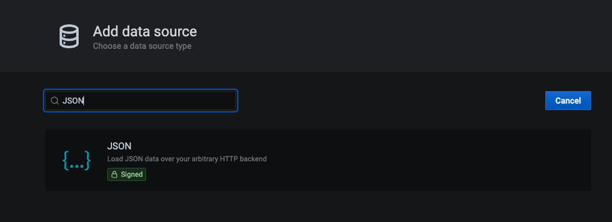
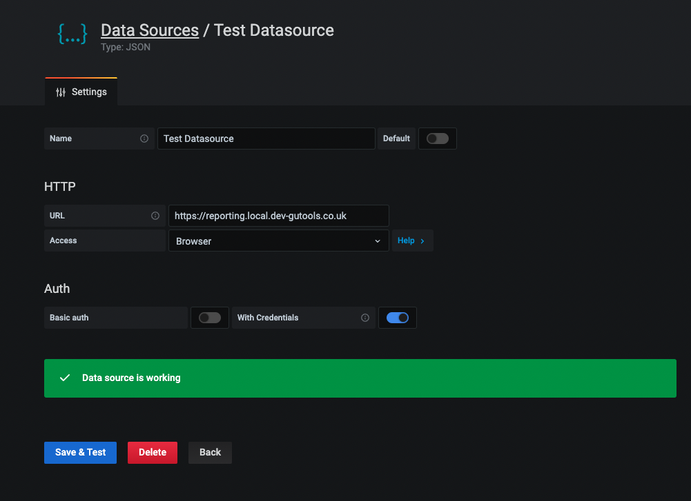
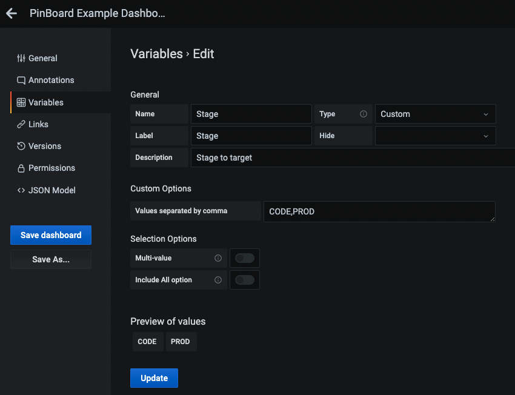
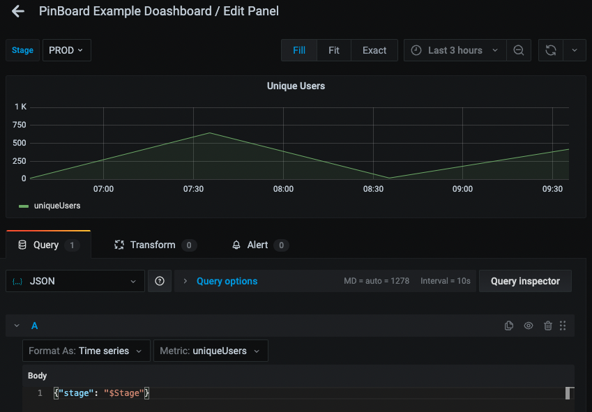

# Local reporting setup

## Start local Reporting Service

```bash
yarn

yarn start
```

## Start local Grafana

```bash
docker run -d -p 3000:3000 --name grafana grafana/grafana:7.5.0
```

# SSH in to instance

```bash
docker exec -it grafana /bin/bash
```

## Install Json plugin for grafana

```bash
grafana-cli plugins install simpod-json-datasource
```

## Restart Container

```bash
exit
docker restart grafana
```

## Setup local data API using Dev nginx

[update nginx config](api-nginx-conf.yaml) and setup locally

```bash
dev-nginx setup-app api-nginx-conf.yaml
```

## Setup local Grafana Dev nginx

[update nginx config](grafana-nginx-conf.yaml) and setup locally

```bash
dev-nginx setup-app grafana-nginx-conf.yaml
```

## Add JSON Datasource in Locally running Grafana

### visit [locally running grafana](https://grafana.local.dev-gutools.co.uk/)

### In settings, add new JSON Data source



### Configure Data source



## Add custom variable in local Grafana



## Create new graph, passing ref to custom variable in body


